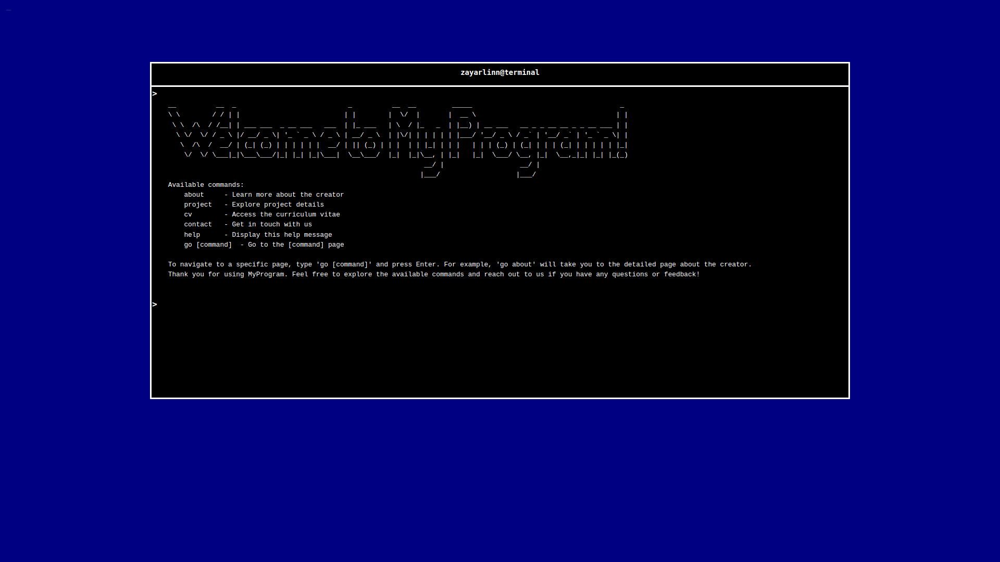

# My Portfolio Website

Welcome to My Portfolio Website! This website is designed to showcase my projects, provide information about me, and allow users to get in touch with me.

## Features

- **Command Prompt Interface**: The portfolio website has a command prompt interface inspired by a terminal, providing a unique user experience.
- **TUI Theme**: The website features a TUI (Text User Interface) theme, giving it a stylish and retro look.
- **Project Showcase**: Explore my projects and view their details, including descriptions, screenshots, and links.
- **About Me**: Learn more about me, my skills, and my background as a web developer.
- **Contact Me**: Get in touch with me using the contact form or through provided contact details.

## Technologies Used

- HTML
- CSS
- JavaScript
- Bootstrap 5.2.3

## Installation and Usage

1. Clone the repository: `git clone https://github.com/your-username/your-repo.git`
2. Navigate to the project directory: `cd your-repo`
3. Open the `index.html` file in a web browser.
4. Explore the website using the command prompt interface.
5. Use the available commands to navigate through projects, learn about me, and contact me.

## Support

If you encounter any issues or have any questions or suggestions, please feel free to contact me at zayarl513@gmail.com.

## Contributing

Contributions are welcome! If you have any improvements or new features to add, please submit a pull request. Ensure that your code adheres to the project's coding standards.

## License

This project is licensed under the [MIT License](LICENSE).